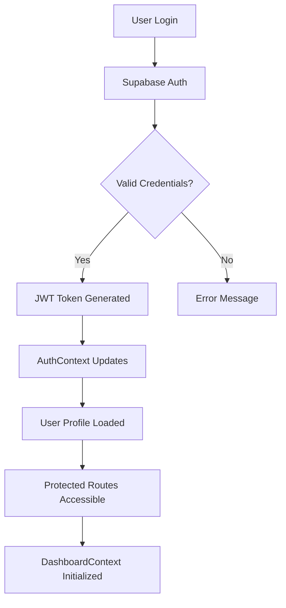
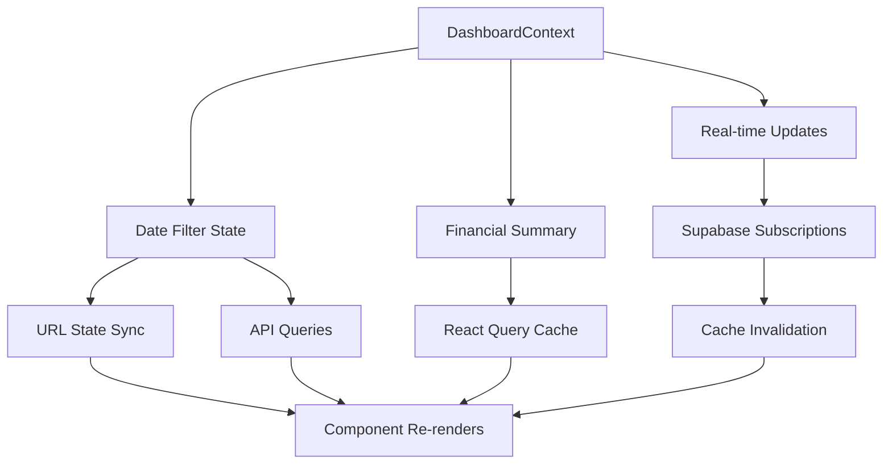
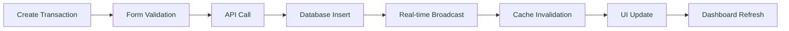

# 🏦 Tracker Zenith - Personal Finance Management System

> **Modern. Intelligent. Comprehensive.**  
> A full-stack personal finance management application built with React, TypeScript, and Supabase, featuring AI-powered document processing and real-time financial insights.


## 🌟 Key Features

### 💰 **Core Financial Management**
- **Transaction Tracking**: Record and categorize income/expenses with detailed metadata
- **Budget Management**: Create, monitor, and track budgets across multiple time periods
- **Payment Methods**: Manage various payment methods and track spending patterns
- **Category Management**: Flexible expense and income categorization system

### 🤖 **AI-Powered Document Processing**
- **Smart OCR**: Extract text from receipts, invoices, and financial documents
- **Intelligent Parsing**: AI-powered data extraction with confidence scoring
- **Auto-Categorization**: Suggest categories and payment methods based on document content
- **Seamless Integration**: Convert processed documents directly into transactions

### 📊 **Advanced Analytics & Insights**
- **Real-time Dashboard**: Live financial overview with trend analysis
- **Interactive Charts**: Spending patterns by category, payment method, and time
- **Budget Analytics**: Performance tracking with health scores and alerts
- **Custom Reports**: Flexible reporting with date range filtering

### 🎨 **Modern User Experience**
- **Responsive Design**: Mobile-first approach with desktop optimization
- **Dark/Light Themes**: Comprehensive theming system
- **Real-time Updates**: Live data synchronization across sessions
- **Intuitive Navigation**: Clean, modern interface with smooth animations

## 🏗️ Architecture Overview

### **Frontend Architecture**
```
┌─────────────────────────────────────────────────────────┐
│                    React Application                     │
├─────────────┬─────────────┬─────────────┬─────────────────┤
│    Pages    │ Components  │   Context   │     Hooks       │
├─────────────┼─────────────┼─────────────┼─────────────────┤
│  • Index    │ • Auth      │ • Auth      │ • useAuth       │
│  • Budgets  │ • Budgets   │ • Dashboard │ • useDashboard  │
│  • Txns     │ • Charts    │ • Toast     │ • useTransaction│
│  • Reports  │ • Layout    │             │ • useQuery      │
│  • Profile  │ • UI        │             │                 │
└─────────────┴─────────────┴─────────────┴─────────────────┘
```

### **Backend Architecture**
```
┌─────────────────────────────────────────────────────────┐
│                  Supabase Backend                       │
├─────────────┬─────────────┬─────────────┬─────────────────┤
│ PostgreSQL  │ Edge Funcs  │ Auth        │ Real-time       │
├─────────────┼─────────────┼─────────────┼─────────────────┤
│ • Tables    │ • Process   │ • JWT       │ • Subscriptions │
│ • Views     │   Document  │ • RLS       │ • Broadcasts    │
│ • RPCs      │ • AI OCR    │ • Profiles  │ • Presence      │
│ • Triggers  │ • Mistral   │ • Sessions  │                 │
└─────────────┴─────────────┴─────────────┴─────────────────┘
```

## 📁 Project Structure

### **Root Level**
```
tracker-zenith/
├── 📄 README.md                    # This comprehensive guide
├── 📄 package.json                 # Dependencies and scripts
├── 📄 tsconfig.json                # TypeScript configuration
├── 📄 tailwind.config.ts           # Tailwind CSS configuration
├── 📄 vite.config.ts               # Vite build configuration
├── 📄 vercel.json                  # Deployment configuration
└── 📄 components.json              # shadcn/ui component configuration
```

### **Source Directory (`src/`)**
```
src/
├── 📁 components/                   # Reusable React components
│   ├── 📁 auth/                    # Authentication components
│   ├── 📁 Budgets/                 # Budget management components
│   ├── 📁 Charts/                  # Data visualization components
│   ├── 📁 Dashboard/               # Dashboard-specific components
│   ├── 📁 Layout/                  # Layout and navigation components
│   ├── 📁 Reports/                 # Reporting components
│   ├── 📁 Transactions/            # Transaction management components
│   └── 📁 ui/                      # Base UI components (shadcn/ui)
├── 📁 context/                     # React Context providers
├── 📁 hooks/                       # Custom React hooks
├── 📁 interfaces/                  # TypeScript type definitions
├── 📁 lib/                         # Core libraries and utilities
│   ├── 📁 api/                     # API layer and data access
│   ├── 📁 auth/                    # Authentication logic
│   ├── 📁 supabase/                # Supabase client configuration
│   ├── 📁 utils/                   # Utility functions
│   └── 📁 validation/              # Form validation schemas
├── 📁 pages/                       # Route components (pages)
│   ├── 📁 auth/                    # Authentication pages
│   ├── 📁 budgets/                 # Budget management pages
│   ├── 📁 payment-methods/         # Payment method pages
│   ├── 📁 profile/                 # User profile pages
│   ├── 📁 reports/                 # Reporting pages
│   └── 📁 transactions/            # Transaction pages
└── 📄 main.tsx                     # Application entry point
```

### **Supabase Directory (`supabase/`)**
```
supabase/
└── 📁 functions/                   # Edge Functions
    └── 📁 process-document/        # AI document processing
        ├── 📄 index.ts             # Main function logic
        └── 📄 README.md            # Function documentation
```

## 🎯 Core Components Deep Dive

### **🏠 Dashboard (`src/pages/Index.tsx`)**
**Purpose**: Main application hub providing financial overview and quick actions
**Features**:
- Real-time financial summary (balance, income, expenses)
- Trend analysis with period comparisons
- Quick transaction entry (income/expense)
- Budget overview and management
- Spending visualization charts

**Key Dependencies**:
- `DashboardContext` for state management
- `TransactionList` for recent transactions
- `BudgetTracker` for budget monitoring
- `SpendingChart` for visual analytics

### **💳 Transaction Management**
**Components**: `TransactionList`, `TransactionForm`, `TransactionFormFields`
**Features**:
- Advanced filtering (category, payment method, date range, type)
- Real-time updates with optimistic UI
- Inline editing and deletion
- Pagination and search
- Bulk operations support

**Data Flow**:
```
User Action → Form Validation → API Call → Database Update → Real-time Sync → UI Update
```

### **💰 Budget System**
**Components**: `BudgetTracker`, `BudgetForm`, `BudgetList`, `BudgetAnalytics`
**Features**:
- Multi-period budgets (daily, weekly, monthly, quarterly, yearly)
- Category-based budget allocation
- Real-time spending tracking
- Alert thresholds and notifications
- Performance analytics with health scores

### **📊 Analytics & Charts**
**Components**: `SpendingChart`, `BudgetAnalytics`, `DashboardSummary`
**Visualization Types**:
- Pie charts for spending distribution
- Bar charts for comparative analysis
- Progress bars for budget tracking
- Trend indicators for financial health

### **🤖 AI Document Processing**
**Components**: `DocumentUploader`
**Edge Function**: `process-document`
**Workflow**:
1. **Upload**: Drag-and-drop or file selection
2. **Storage**: Secure file storage in Supabase
3. **Processing**: AI-powered OCR and data extraction via Mistral AI
4. **Review**: User verification of extracted data with confidence scoring
5. **Integration**: Automatic transaction creation with suggested categorization

### **🔐 Authentication Pages**
**Components**: `Login.tsx`, `Signup.tsx`, `LoginForm`, `SignupForm`
**Features**:
- Email/password authentication
- Form validation with error handling
- Password visibility toggle
- Responsive design with centered layout
- Integration with Supabase Auth

### **📄 Application Pages**
**Route Structure**:
```
/                           # Dashboard (Index.tsx)
├── /budgets               # Budget management page
├── /transactions          # Transaction list and management
├── /payment-methods       # Payment method configuration
├── /profile              # User profile management
├── /reports              # Financial reports and analytics
├── /auth/login           # Login page
└── /auth/signup          # Registration page
```

**Page Components**:
- **`Index.tsx`**: Main dashboard with overview widgets
- **`budgets/index.tsx`**: Comprehensive budget management
- **`transactions/index.tsx`**: Transaction list with document uploader
- **`payment-methods/index.tsx`**: Payment method CRUD operations
- **`profile/index.tsx`**: User profile settings and information

## 🔗 Data Flow & State Management

### **Context Providers**
**`AuthContext.tsx`** (Legacy - now re-exports from `lib/auth`):
- User authentication state
- Login/logout functions
- Profile management
- Session persistence

**`DashboardContext.tsx`**:
- Date filter state management (month, quarter, year, custom ranges)
- Financial summary data (balance, income, expenses, trends)
- Real-time data refresh capabilities
- URL state synchronization for date filters

### **React Query Integration**
- **Query Keys**: Consistent key patterns for cache management
  - `['expenses', userId, startDate, endDate]`
  - `['budgets', userId]`
  - `['dashboardSummary', userId, startDate, endDate]`
  - `['spendingByCategory', userId, startDate, endDate]`
- **Cache Invalidation**: Strategic invalidation on mutations
- **Real-time Updates**: Supabase subscriptions trigger cache invalidation

### **Authentication Flow**


### **Dashboard State Management**


### **Transaction Lifecycle**


## 🛠️ Technology Stack

### **Frontend Technologies**
| Technology | Version | Purpose |
|------------|---------|---------|
| **React** | 18.x | UI library for building interactive interfaces |
| **TypeScript** | 5.x | Type-safe JavaScript development |
| **Vite** | 5.x | Fast build tool and development server |
| **Tailwind CSS** | 3.x | Utility-first CSS framework |
| **shadcn/ui** | Latest | High-quality, accessible component library |
| **React Query** | 5.x | Server state management and caching |
| **React Router** | 6.x | Client-side routing and navigation |
| **React Hook Form** | 7.x | Performant form handling |
| **date-fns** | 3.x | Date manipulation and formatting |
| **Recharts** | 2.x | Composable charting library |

### **Backend Technologies**
| Technology | Purpose |
|------------|---------|
| **Supabase** | Backend-as-a-Service platform |
| **PostgreSQL** | Primary database with advanced features |
| **Row Level Security** | Fine-grained access control |
| **Real-time** | Live data synchronization |
| **Edge Functions** | Serverless compute with Deno runtime |
| **Mistral AI** | AI-powered document processing |

### **Development & Deployment**
| Tool | Purpose |
|------|---------|
| **ESLint** | Code linting and quality enforcement |
| **Prettier** | Code formatting |
| **Vercel** | Frontend deployment and hosting |
| **GitHub Actions** | CI/CD pipeline |
| **TypeScript** | Static type checking |

## 🚀 Getting Started

### **Prerequisites**
- **Node.js** 18.x or higher
- **npm** or **bun** package manager
- **Supabase** account and project
- **Git** for version control

### **Environment Setup**
1. **Clone the repository**
   ```bash
   git clone https://github.com/your-username/tracker-zenith.git
   cd tracker-zenith
   ```

2. **Install dependencies**
   ```bash
   # Using npm
   npm install
   
   # Using bun (recommended)
   bun install
   ```

3. **Configure environment variables**
   ```bash
   cp .env.example .env.local
   ```
   
   Add your Supabase credentials:
   ```env
   VITE_SUPABASE_URL=your_supabase_url
   VITE_SUPABASE_ANON_KEY=your_supabase_anon_key
   ```

4. **Set up database schema**
   ```bash
   # Initialize Supabase (if not already done)
   supabase init
   
   # Run migrations
   supabase db reset
   ```

5. **Start development server**
   ```bash
   npm run dev
   # or
   bun dev
   ```

### **Supabase Setup**
1. Create a new Supabase project
2. Run the provided SQL schema (see database schema in project)
3. Set up Row Level Security policies
4. Configure authentication providers
5. Deploy Edge Functions:
   ```bash
   supabase functions deploy process-document
   ```

## 🗄️ Database Schema

### **Core Tables**
```sql
-- Users (managed by Supabase Auth)
auth.users

-- Expense Categories
expense_category (id, name, description, created_by, created_at, updated_at, isdeleted)

-- Income Categories  
income_category (id, name, description, created_by, created_at, updated_at, isdeleted)

-- Payment Methods
payment_methods (id, method_name, created_by, created_at, updated_at, isdeleted)

-- Expenses (main transaction table)
expense (id, user_id, date, description, payment_method_id, created_by, created_at, updated_at, isdeleted)

-- Expense Items (transaction line items)
expense_item (id, expense_id, category_id, income_category_id, amount, description, created_by, created_at, updated_at, isdeleted)

-- Budgets
budget (id, user_id, name, amount, period, start_date, end_date, created_by, created_at, updated_at, isdeleted)

-- Budget Categories (many-to-many relationship)
budget_category (budget_id, category_id, alert_threshold, created_by, created_at, updated_at, isdeleted)
```

### **Key Relationships**
- Users → Expenses (one-to-many)
- Expenses → Expense Items (one-to-many)
- Categories → Expense Items (many-to-many)
- Payment Methods → Expenses (many-to-one)
- Budgets → Categories (many-to-many via budget_category)

## 🔧 API Layer

### **API Structure (`src/lib/api/`)**
```
api/
├── 📄 budgetApi.ts              # Budget CRUD operations
├── 📄 expenseApi.ts             # Transaction management
├── 📄 paymentMethodApi.ts       # Payment method operations
└── 📄 transactionApi.ts         # Transaction utilities
```

### **Utilities & Validation (`src/lib/`)**
```
lib/
├── 📁 auth/                     # Authentication utilities
│   ├── 📁 api/                 # Auth API functions
│   ├── 📁 hooks/               # Auth React hooks (useAuth, useAuthState)
│   ├── 📁 state/               # Auth state management
│   └── 📁 utils/               # Auth utility functions
├── 📁 supabase/                # Supabase client configuration
│   └── 📄 supabase.ts          # Supabase client initialization
├── 📁 utils/                   # General utilities
│   ├── 📄 expense-helpers.ts   # Transaction processing utilities
│   └── 📄 index.ts             # Common utility functions (formatCurrency, etc.)
└── 📁 validation/              # Form validation schemas
    └── 📄 transactionValidation.ts # Transaction form validation
```

### **Key Utility Functions**
```typescript
// General Utilities
formatCurrency(amount: number): string
cn(...classes): string // Tailwind class name merging
getPaymentMethodName(methodId: number): string

// Expense Helpers
groupItemsByExpenseId(items: ExpenseItem[]): Record<number, ExpenseItem[]>
combineExpensesWithItems(expenses, items, paymentMethods): Expense[]
loadExpensesWithRelations(expenses: Expense[]): Promise<Expense[]>
handleSupabaseError(error: any, context: string): never

// Validation
validateTransaction(data: TransactionData): FormErrors
isFormValid(data: TransactionData): boolean
```

### **Key API Functions**
```typescript
// Budget Management
budgetApi.create(budget: CreateBudgetRequest)
budgetApi.getAllByUser(userId: string)
budgetApi.getByPeriod(userId: string, period: PeriodEnum)
budgetApi.update(id: number, data: UpdateBudgetRequest)
budgetApi.delete(id: number)
budgetApi.getCategories() // Expense categories for budget forms

// Transaction Management
expenseApi.getAllByUser(userId: string, options?: QueryOptions)
expenseApi.create(expense: CreateExpenseRequest)
expenseApi.update(id: number, data: UpdateExpenseRequest)
expenseApi.delete(id: number)
expenseApi.getSummaryByCategory(userId: string, startDate: string, endDate: string)
expenseApi.getSummaryByPaymentMethod(userId: string, startDate: string, endDate: string)
expenseApi.getCategories() // Get all expense categories
expenseApi.getPaymentMethods() // Get all payment methods

// Payment Method Management
paymentMethodApi.getAll()
paymentMethodApi.create(method: CreatePaymentMethodRequest)
paymentMethodApi.update(id: number, data: Partial<PaymentMethod>)
paymentMethodApi.delete(id: number)

// Real-time Subscriptions
expenseApi.subscribeToExpenses(userId: string, callback: Function)

// Supabase RPC Functions (stored procedures)
supabase.rpc('get_total_income', { p_user_id, p_start_date, p_end_date })
supabase.rpc('get_total_expenses', { p_user_id, p_start_date, p_end_date })
supabase.rpc('get_user_balance', { p_user_id, p_start_date, p_end_date })
supabase.rpc('get_period_comparison', { p_user_id, p_current_start, p_current_end, p_previous_start, p_previous_end, p_transaction_type })
supabase.rpc('calculate_budget_spending_by_date', { budget_id, p_start_date, p_end_date })
supabase.rpc('get_spending_by_category', { p_user_id, p_start_date, p_end_date })
supabase.rpc('insert_document_data', { p_user_id, p_file_path, p_original_filename, p_file_size, p_mime_type })
supabase.rpc('update_document_processing_status', { p_document_id, p_status })
supabase.rpc('create_transaction_from_document', { p_document_id, p_category_id, p_category_type, p_payment_method_id, p_amount, p_description })
```

## 🎨 UI Component System

### **Design System**
- **Colors**: Custom finance-themed color palette
- **Typography**: Inter font family with responsive scales
- **Spacing**: Consistent 4px grid system
- **Components**: shadcn/ui as the foundation
- **Icons**: Lucide React icon library
- **Animations**: Tailwind CSS transitions

### **Component Hierarchy**
```
Layout
├── Navigation (Sidebar/Header)
├── Main Content Area
│   ├── Page Header
│   ├── Action Bar
│   ├── Content Grid
│   │   ├── Cards
│   │   ├── Tables
│   │   ├── Charts
│   │   └── Forms
│   └── Modals/Dialogs
└── Toast Notifications
```

### **Responsive Breakpoints**
- **Mobile**: 320px - 768px
- **Tablet**: 768px - 1024px
- **Desktop**: 1024px - 1440px
- **Large**: 1440px+

## 🔒 Security & Authentication

### **Authentication Features**
- **Email/Password** authentication via Supabase Auth
- **JWT-based** session management
- **Protected routes** with authentication guards
- **Profile management** with custom user data
- **Session persistence** across browser sessions

### **Security Measures**
- **Row Level Security (RLS)** on all database tables
- **Input validation** on all forms and API endpoints
- **SQL injection prevention** through parameterized queries
- **XSS protection** via proper input sanitization
- **CORS configuration** for API security

## 📱 Progressive Web App Features

### **PWA Capabilities**
- **Responsive design** works on all device sizes
- **Offline functionality** for core features (planned)
- **Fast loading** with Vite's optimized bundling
- **Modern browser features** utilizing latest web APIs

## 🚀 Deployment

### **Frontend Deployment (Vercel)**
1. **Connect repository** to Vercel
2. **Configure build settings**:
   ```json
   {
     "buildCommand": "bun run build",
     "outputDirectory": "dist",
     "installCommand": "bun install"
   }
   ```
3. **Set environment variables** in Vercel dashboard
4. **Deploy** automatically on push to main branch

### **Backend Deployment (Supabase)**
1. **Database migrations** are automatically applied
2. **Edge Functions** deployed via Supabase CLI:
   ```bash
   supabase functions deploy --project-ref your-project-ref
   ```
3. **Environment variables** configured in Supabase dashboard

## 🧪 Testing Strategy

### **Testing Approach**
- **Unit Tests**: Individual component and function testing
- **Integration Tests**: API and database interaction testing
- **E2E Tests**: Full user workflow testing
- **Performance Tests**: Load and stress testing

### **Testing Tools**
- **Vitest**: Fast unit testing framework
- **Testing Library**: React component testing
- **Playwright**: End-to-end testing
- **MSW**: API mocking for tests

## 🤝 Contributing

### **Development Workflow**
1. **Fork** the repository
2. **Create** a feature branch: `git checkout -b feature/amazing-feature`
3. **Make** your changes following the coding standards
4. **Test** your changes thoroughly
5. **Commit** with conventional commit messages
6. **Push** to your fork: `git push origin feature/amazing-feature`
7. **Open** a Pull Request with detailed description

### **Coding Standards**
- **TypeScript**: Strict typing, no `any` types
- **ESLint**: Follow the configured rules
- **Prettier**: Consistent code formatting
- **Naming**: Use descriptive, camelCase naming
- **Components**: Use functional components with hooks
- **Comments**: Document complex logic and business rules

### **Commit Convention**
```
type(scope): description

feat(transactions): add bulk delete functionality
fix(dashboard): resolve date filter bug
docs(readme): update installation instructions
style(ui): improve button hover states
refactor(api): optimize query performance
test(budgets): add unit tests for budget calculations
```

## 📊 Performance Optimization

### **Frontend Optimizations**
- **Code Splitting**: Route-based lazy loading
- **Bundle Analysis**: Regular bundle size monitoring
- **Image Optimization**: WebP format with fallbacks
- **Caching**: React Query for intelligent caching
- **Memoization**: React.memo and useMemo for expensive operations

### **Backend Optimizations**
- **Database Indexing**: Strategic index placement
- **Query Optimization**: Efficient SQL queries
- **Connection Pooling**: Supabase handles connection management
- **Real-time Efficiency**: Targeted subscriptions

## 🐛 Troubleshooting

### **Common Issues**

**Build Errors**
```bash
# Clear node_modules and reinstall
rm -rf node_modules package-lock.json
npm install

# Clear Vite cache
npm run dev -- --force
```

**Database Connection Issues**
- Verify Supabase URL and API keys
- Check Row Level Security policies
- Ensure user has proper permissions

**Authentication Problems**
- Clear browser localStorage
- Check Supabase Auth configuration
- Verify JWT token expiration

## 📈 Roadmap

### **Short Term (1-3 months)**
- [ ] Reports based on semantic search
- [ ] Notification events based on data transactions
- [ ] Better ui components and ux
- [ ] Detailed budget tracking

### **Medium Term (3-6 months)**
- [ ] Financial goal tracking
- [ ] ChatBot capable of tool calls and api calls

### **Long Term (6+ months)**
- [ ] Investment portfolio tracking
- [ ] Tax preparation assistance
- [ ] Financial advisor integration
- [ ] Multi-user family accounts

## 📞 Support & Community

### **Getting Help**
- **Documentation**: Comprehensive guides and API references
- **Issues**: GitHub Issues for bug reports and feature requests
- **Discussions**: GitHub Discussions for questions and ideas
- **Discord**: Community chat server (link in repository)

### **Links**
- **Live Demo**: [https://tracker-zenith.onrender.com/](https://tracker-zenith.onrender.com/)
- **Documentation**: [https://tracker-zenith.onrender.com/](https://tracker-zenith.onrender.com/)
- **API Reference**: [https://tracker-zenith.onrender.com/](https://tracker-zenith.onrender.com/)

## 📄 License

This project is licensed under the **MIT License** - see the [LICENSE](LICENSE) file for details.

---

<div align="center">

**Built with ❤️ using React, TypeScript, and Supabase**

[](https://github.com/your-username/tracker-zenith)
[](https://github.com/your-username/tracker-zenith/fork)
[](https://github.com/your-username/tracker-zenith/issues)

</div> 